# Temp (🚧 under construction)
Employee management system built with .NET 8 and Angular 17.

## Quick Start

### Prerequisites
- Docker & Docker Compose
- .NET 8 SDK (for local development)
- Node.js 18+ (for Angular development)

### Environment Setup

**IMPORTANT:** For security, secrets are managed via environment variables.

1. Copy the environment template:
   ```bash
   cp .env.template .env
   ```

2. Edit `.env` and update the values (especially `JWT_SECRET` for production)

3. **Never commit `.env` to version control!**

### Startup
```bash
docker compose up --detach
```

---
## Endpoints

### Development Environment

**App UI:**
- HTTP: http://localhost:4323
- HTTPS: https://localhost:4443 (self-signed certificate)

**App API:**
- HTTP: http://localhost:5000/swagger/index.html
- HTTPS: https://localhost:5001/swagger/index.html

**Redis UI:**
- http://localhost:8081

### Production Environment

**App UI:**
- HTTP: http://localhost
- HTTPS: https://localhost (self-signed certificate, replace with real certificate)

**App API:**
- HTTP: http://localhost:5000/swagger/index.html
- HTTPS: https://localhost:5001/swagger/index.html

---
## Default Credentials

**⚠️ SECURITY WARNING:** Change these credentials in production!

**App (Default Admin):**
- Username: `johndoe@test.com`
- Password: `5B3jt4H8$$3t03E88`

**Redis UI:**
- Username: `root` (configurable via `REDIS_UI_USER` env var)
- Password: `toor` (configurable via `REDIS_UI_PASSWORD` env var)

---
## Security Notes

- All secrets should be configured via environment variables (see `.env.template`)
- JWT secret token is loaded from `JWT_SECRET` environment variable
- Database passwords should be strong and unique
- For production, use Azure Key Vault or similar secret management
- Never commit `.env` files to version control

---
## Production Deployment

### Prerequisites
- Production-ready environment (Linux server, cloud VM, or Kubernetes cluster)
- Valid SSL certificates (replace self-signed certificates)
- Secure password management (Azure Key Vault, AWS Secrets Manager, etc.)

### Production Setup

1. **Copy and configure environment variables:**
   ```bash
   cp .env.template .env
   ```

2. **Update `.env` with production values:**
   - Generate a strong JWT_SECRET: `openssl rand -base64 64`
   - Set strong passwords for SQL_SA_PASSWORD and REDIS_PASSWORD
   - Configure production database connection strings
   - For Azure: Use real Azure Storage connection instead of Azurite

3. **Deploy using production configuration:**
   ```bash
   docker compose -f docker-compose.yml -f docker-compose.prod.yml up -d
   ```

4. **Verify deployment:**
   ```bash
   docker compose ps
   docker compose logs
   ```

### Production Checklist

- [ ] Replace self-signed SSL certificates with valid certificates (Let's Encrypt or commercial CA)
- [ ] Configure firewall rules to restrict access
- [ ] Set up automated backups for SQL Server and Redis data
- [ ] Configure monitoring and logging (Application Insights, ELK Stack, etc.)
- [ ] Enable HTTPS-only mode (disable HTTP port 80)
- [ ] Review and harden security settings
- [ ] Set up CI/CD pipeline for automated deployments
- [ ] Configure reverse proxy (nginx, Traefik) if needed
- [ ] Test disaster recovery procedures
- [ ] Document runbook for operations team

### Security Best Practices

1. **Never use default passwords in production**
2. **Rotate secrets regularly** (JWT tokens, database passwords)
3. **Use managed secrets** (Azure Key Vault, AWS Secrets Manager)
4. **Enable HTTPS only** - redirect HTTP to HTTPS
5. **Regular security updates** - keep containers and dependencies updated
6. **Monitor logs** for suspicious activity
7. **Implement rate limiting** and DDoS protection
8. **Regular backups** with tested restore procedures

### Scaling Considerations

For production at scale, consider:
- **Database:** Use managed Azure SQL Database or AWS RDS instead of containerized SQL Server
- **Cache:** Use Azure Cache for Redis or AWS ElastiCache
- **Storage:** Use Azure Blob Storage instead of Azurite
- **Load Balancing:** Add nginx or cloud load balancer in front of services
- **Container Orchestration:** Deploy to Kubernetes (AKS, EKS, GKE) for high availability

---
### UI (admin workflow)

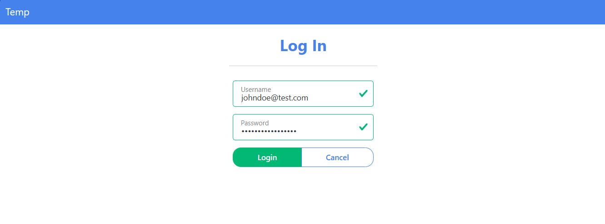
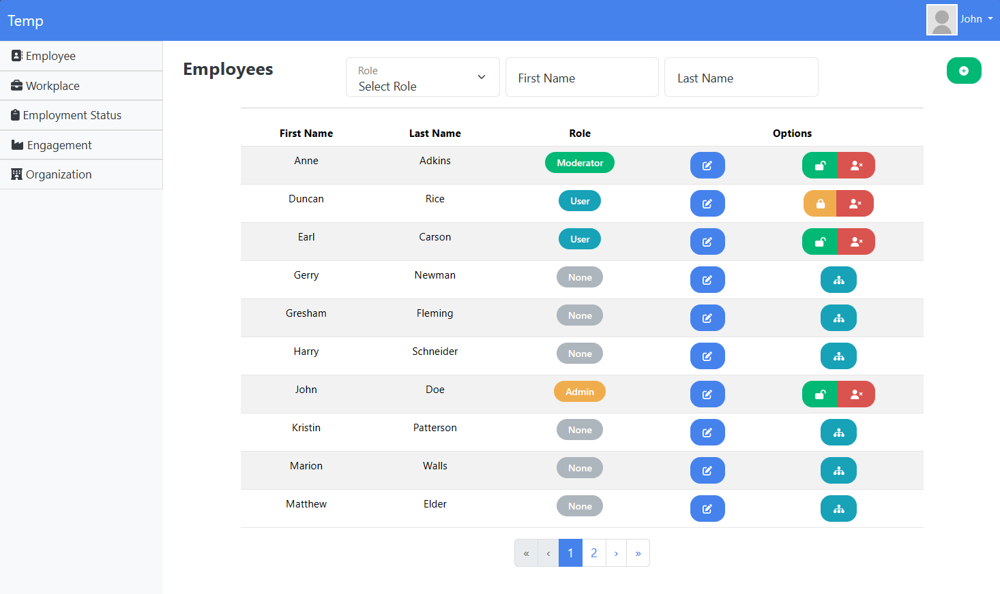
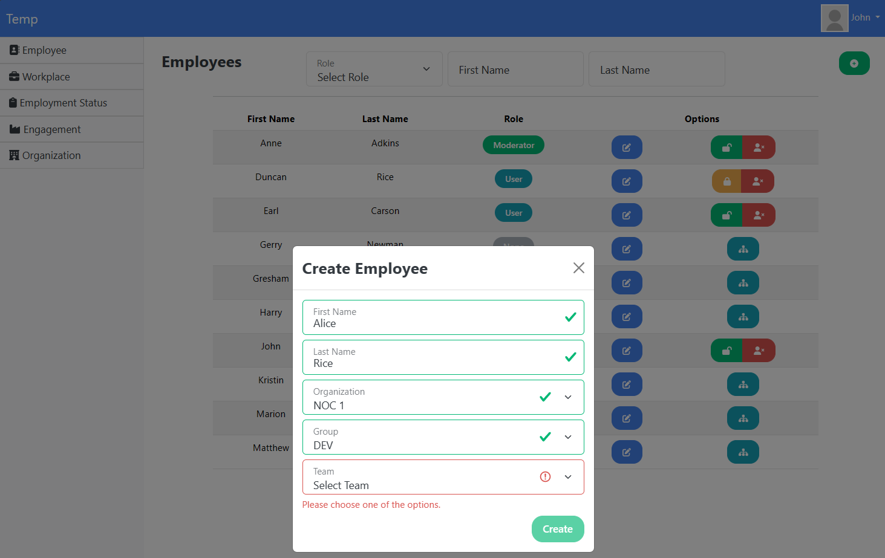
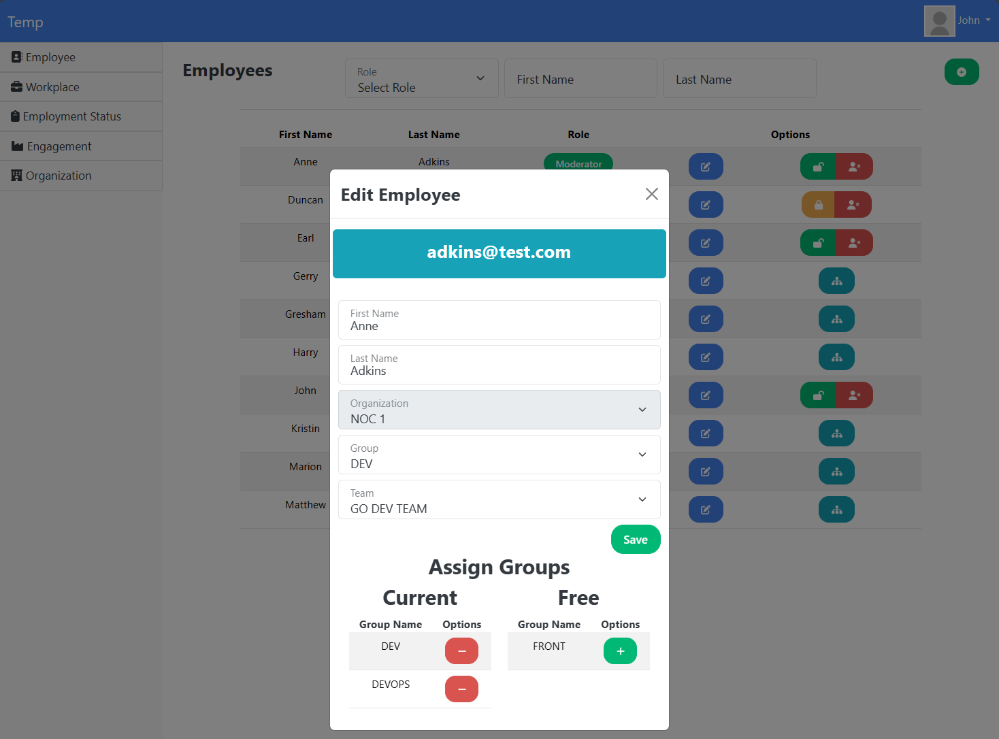

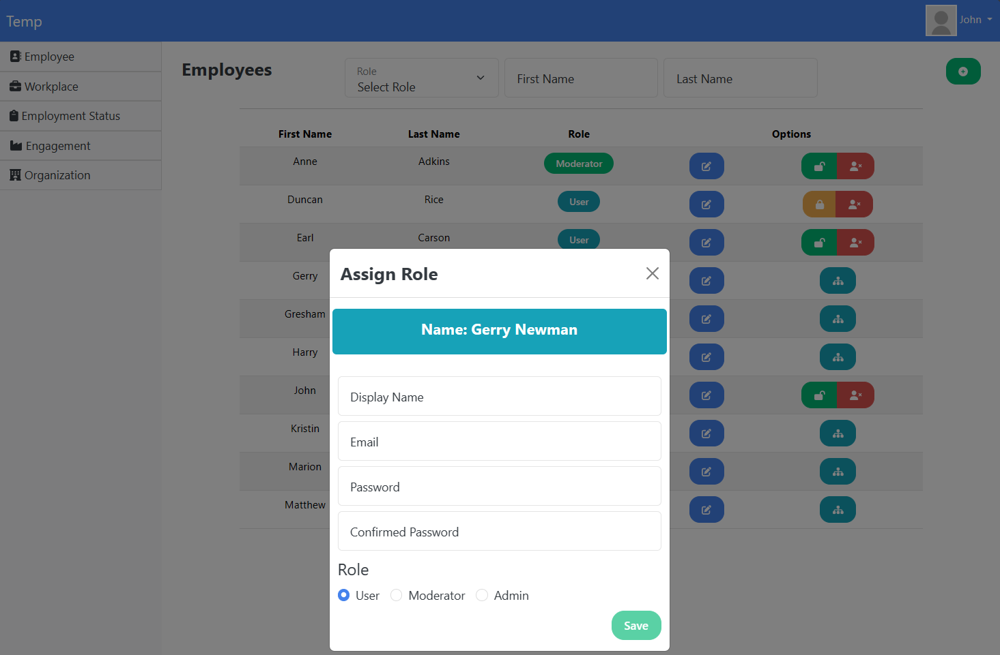
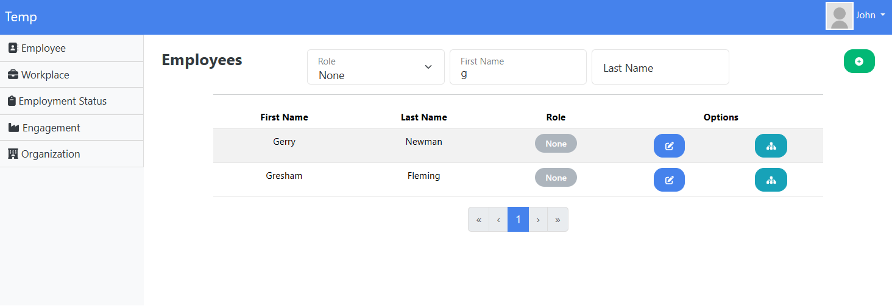
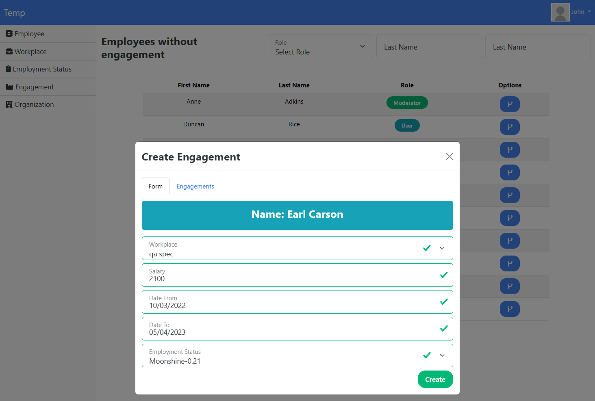
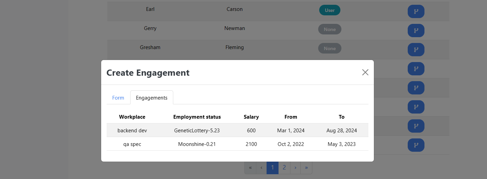
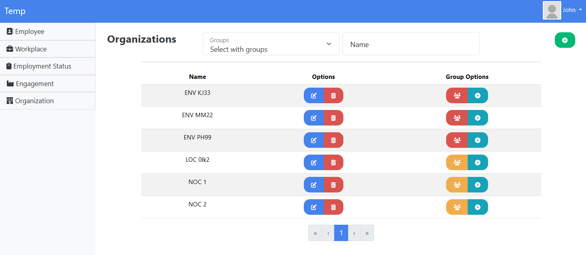
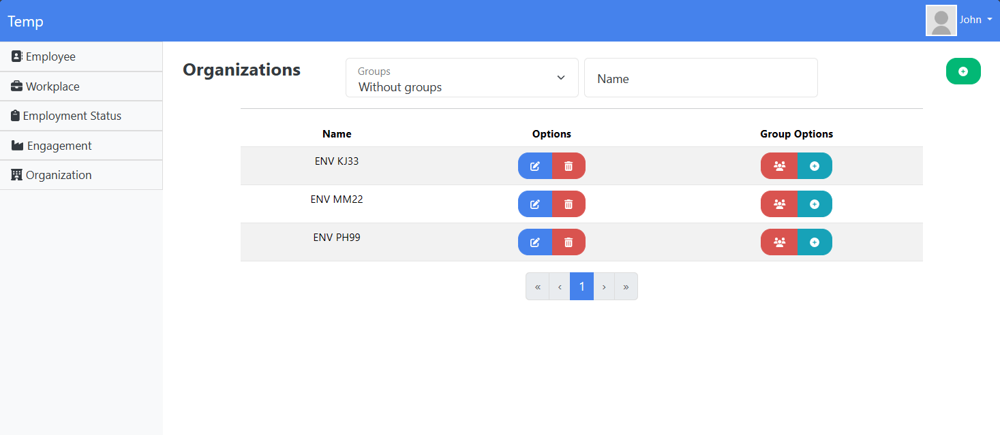

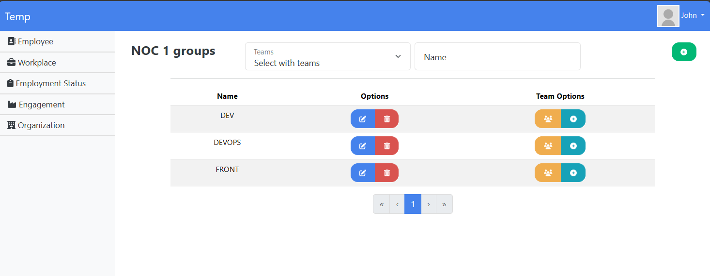
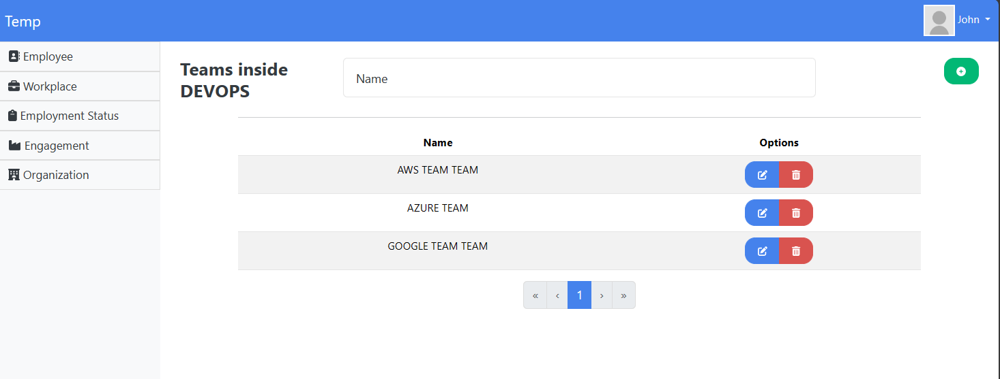