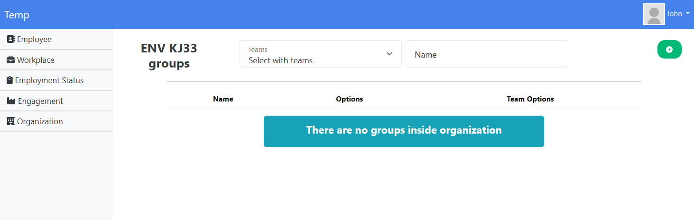

# Temp (🚧 under construction)
Employee management system built with .NET 8 and Angular 20.

## Quick Start

### Prerequisites
- Docker & Docker Compose
- .NET 8 SDK (for local development)
- Node.js 20+ (for Angular development)

### Environment Setup

**IMPORTANT:** For security, secrets are managed via environment variables.

1. Copy the environment template:
   ```bash
   cp .env.template .env
   ```

2. Edit `.env` and update the values (especially `JWT_SECRET` for production)

3. **Never commit `.env` to version control!**

### Startup

**Option 1: Using Docker Compose**
```bash
docker compose up --detach
```

**Option 2: Using Helper Scripts**
```bash
# Linux/Mac
./scripts/dev.sh start

# Windows PowerShell
.\scripts\dev.ps1 start

# Any platform with make
make start
```

---
## Endpoints

### Development Environment

**App UI:**
- HTTP: http://localhost:4323
- HTTPS: https://localhost:4443 (self-signed certificate)

**App API:**
- HTTP: http://localhost:5000/swagger/index.html
- HTTPS: https://localhost:5001/swagger/index.html

**Redis UI:**
- http://localhost:8081

### Production Environment

**App UI:**
- HTTP: http://localhost
- HTTPS: https://localhost (self-signed certificate, replace with real certificate)

**App API:**
- HTTP: http://localhost:5000/swagger/index.html
- HTTPS: https://localhost:5001/swagger/index.html

---
## Default Credentials

**⚠️ SECURITY WARNING:** Change these credentials in production!

**App (Default Admin):**
- Username: `johndoe@test.com`
- Password: `5B3jt4H8$$3t03E88`

**Redis UI:**
- Username: `root` (configurable via `REDIS_UI_USER` env var)
- Password: `toor` (configurable via `REDIS_UI_PASSWORD` env var)

---
## Production Deployment

### Production Setup

1. **Copy and configure environment variables:**
   ```bash
   cp .env.template .env
   ```

2. **Update `.env` with production values:**
   - Generate a strong JWT_SECRET: `openssl rand -base64 64`
   - Set strong passwords for SQL_SA_PASSWORD and REDIS_PASSWORD
   - Configure production database connection strings
   - For Azure: Use real Azure Storage connection instead of Azurite

3. **Deploy using production configuration:**
   ```bash
   docker compose -f docker-compose.yml -f docker-compose.prod.yml up -d
   ```

4. **Verify deployment:**
   ```bash
   docker compose ps
   docker compose logs
   ```

---
## CI/CD & Automation

This project includes comprehensive CI/CD automation using GitHub Actions.

### Quick Commands

**Development Helper Scripts:**
```bash
# Linux/Mac
./scripts/dev.sh [command]

# Windows PowerShell
.\scripts\dev.ps1 [command]

# Cross-platform (Make)
make [command]
```

**Available Commands:**
- `start` - Start development environment
- `stop` - Stop development environment
- `restart` - Restart services
- `logs` - View logs
- `rebuild` - Rebuild containers
- `health` - Check service health
- `test` - Run all tests
- `db-migrate` - Run database migrations

### GitHub Actions Workflows

**CI Pipeline (`.github/workflows/ci.yml`):**
- ✅ Builds .NET API and Angular SPA
- ✅ Runs automated tests
- ✅ Performs code quality checks
- ✅ Builds and pushes Docker images
- ✅ Security scanning with Trivy

**Deployment Pipeline (`.github/workflows/deploy.yml`):**
- 🚀 Automated deployment to staging/production
- 🔄 Automatic rollback on failure
- 📊 Health check verification
- 💬 Slack notifications (optional)

**Triggers:**
- Push to `master` or `develop` → Run CI
- Pull request → Run CI
- New release → Deploy to production
- Manual workflow dispatch → Deploy to any environment

---
### UI (admin workflow)




